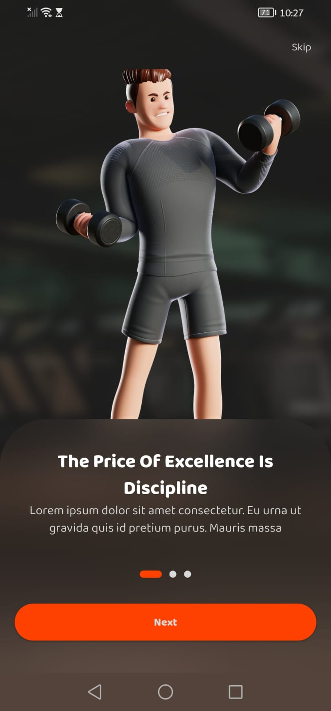
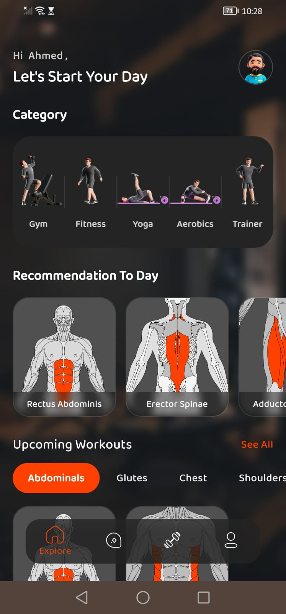
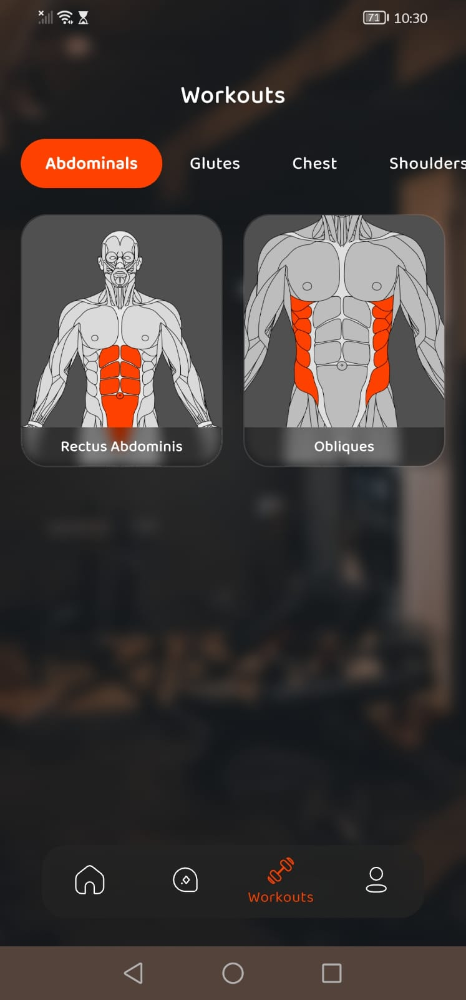
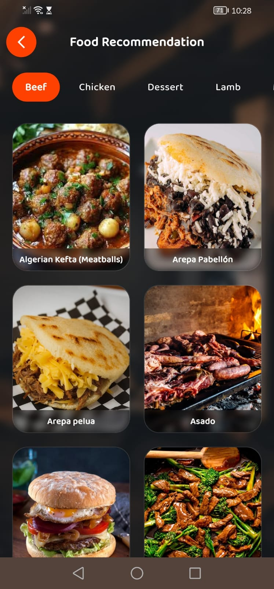
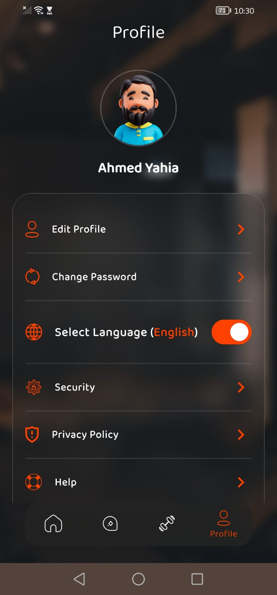
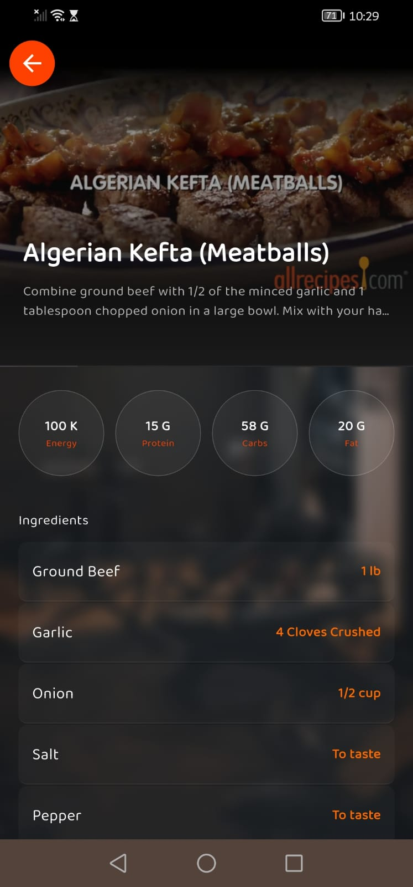
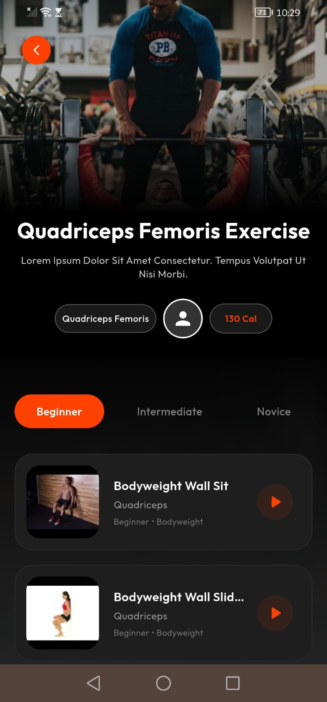

# 💪 FitCoach — Smart Fitness & Nutrition App

> *The Price Of Excellence Is Discipline*

A feature-rich **Flutter** fitness application that combines AI-powered coaching, personalized workout plans, and smart nutrition recommendations — all in one beautifully designed dark-themed mobile experience.

---

## 📱 Screenshots
 
| Onboarding | Home | Workouts |
|:---:|:---:|:---:|
|  |  |  |
 
| Food Recommendations | Profile | Food Details |
|:---:|:---:|:---:|
|  |  |  |
 
| Exercise Videos |
|:---:|
|  |
 
---

## ✨ Features

### 🤖 Smart Coach (AI Chatbot)
An interactive AI-powered coach that greets you by name and answers your fitness questions in real time. Simply tap **"Get Started"** and ask anything — from workout tips to nutrition advice.

### 🏠 Home Dashboard
A personalized home screen showing:
- **Daily greeting** with your name
- **Workout categories**: Gym, Fitness, Yoga, Aerobics, Trainer
- **Today's muscle recommendations** (e.g., Rectus Abdominis, Erector Spinae)
- **Food recommendations** by category (Beef, Chicken, Dessert, Lamb…)
- **Popular Training** cards with task count and difficulty level

### 🏋️ Workouts
Browse exercises organized by **muscle group**:
- Abdominals, Glutes, Chest, Shoulders, and more
- Each muscle group shows anatomical diagrams highlighting the targeted area
- Drill down to see exercise lists with **Beginner / Intermediate / Novice** level tabs
- Each exercise card shows name, muscle targeted, equipment type, calorie burn, and a play button for video guidance

### 🥗 Food Recommendations
Discover healthy meals filtered by category:
- Visual recipe cards with full-screen food photography
- Each recipe detail page shows: **Energy (kcal), Protein, Carbs, Fat**
- Full ingredient list with quantities
- Recipe instructions sourced and displayed cleanly

### 👤 Profile
Manage your personal account with:
- Avatar + display name
- Edit Profile
- Change Password
- Language selection (English / Arabic toggle)
- Security settings
- Privacy Policy & Help

### 🎬 Onboarding
A smooth 3-slide onboarding experience with 3D animated characters, motivational quotes, and a **Skip** option for returning users.

---

## 🗂️ Project Structure

```
lib/
├── config/               # App-wide configuration & themes
├── core/                 # Shared utilities, base classes, services
└── features/
    ├── auth/             # Login, register, authentication flow
    ├── edit_profile/     # Profile editing screen
    ├── exercise/         # Exercise detail pages & video player
    ├── home/             # Home dashboard & category browsing
    ├── meals/            # Food recommendations & recipe details
    ├── on_boarding/      # Onboarding slides
    ├── popular_training/ # Popular training plans listing
    ├── recommendations/  # Personalized daily recommendations
    ├── smart_coach/      # AI chatbot interface
    └── workouts/         # Workout browser by muscle group
```

The project follows a **feature-first clean architecture**, keeping each feature self-contained with its own presentation, domain, and data layers.

---

## 🛠️ Tech Stack

| Layer | Technology |
|-------|-----------|
| Framework | Flutter (Dart) |
| State Management | *(e.g., BLoC / Provider / Riverpod)* |
| Navigation | *(e.g., GoRouter / AutoRoute)* |
| HTTP Client | *(e.g., Dio / http)* |
| Local Storage | *(e.g., Hive / SharedPreferences)* |
| AI Chat | Anthropic Claude API / OpenAI |
| Design System | Custom dark theme with orange accent (`#FF5722`) |

> **Note:** Replace the placeholders above with your actual packages.

---

## 🚀 Getting Started

### Prerequisites
- Flutter SDK `>=3.0.0`
- Dart `>=3.0.0`
- Android Studio / VS Code with Flutter plugin

### Installation

```bash
# Clone the repository
git clone https://github.com/your-username/fitcoach.git

# Navigate into the project
cd fitcoach

# Install dependencies
flutter pub get

# Run the app
flutter run
```

### Build for Release

```bash
# Android APK
flutter build apk --release

# iOS
flutter build ios --release
```

---

## 🎨 Design System

- **Primary Color:** `#FF5722` (Orange)
- **Background:** Dark gym photography with blur overlay
- **Typography:** Bold white headings, muted secondary text
- **Components:** Rounded pill buttons, anatomical muscle cards, bottom navigation bar with 4 tabs (Explore, Smart Coach, Workouts, Profile)

---

## 📄 License

This project is licensed under the MIT License — see the [LICENSE](LICENSE) file for details.

---

## 👨‍💻 Author

**Ahmed Yahia**
- Built with Flutter 💙
- Designed with passion for fitness & technology

---

> *"The Price Of Excellence Is Discipline"* 🔥